# Guided Translator

**Guided Translator** is a terminology-aware technical translation assistant designed specifically for standards documents (EN, ISO, IEC). It leverages Google Gemini's multimodal capabilities to extract and translate complex documents with high structural fidelity.

## 🚀 Key Features

- **AI-Powered Visual Parsing**: Uses Gemini 1.5 Flash Vision to "read" PDF pages as images, ensuring complex layouts, tables, and multi-column structures are perfectly preserved in Markdown format.
- **MinerU Cloud Integration**: Optionally leverage [MinerU](https://mineru.net)'s advanced PDF extraction engine for superior accuracy on complex technical documents with formulas and tables.
- **Terminology Awareness**: Integrates CSV-based glossaries and learns from user edits to maintain consistency across technical translations.
- **Agentic Editing Interface**: Analyzes manual edits to detect terminological improvements and offers to apply them throughout the document.
- **Multi-Key Management**: Supports multiple Gemini API keys with automatic rate-limit switching to ensure uninterrupted long-document translation.
- **Local Persistence**: Save and resume projects locally using a robust browser-based storage service.
- **Markdown & PDF Support**: Accept and process both raw Markdown and complex PDF files as source documents.

## 🛠 Tech Stack

- **Frontend**: React 19, Vite, TypeScript
- **Styling**: Tailwind CSS
- **PDF Processing**: PDF.js (Mozilla), MinerU Cloud API (optional)
- **AI Models**: Google Gemini 2.0 Flash Experimental
- **Icons**: Lucide React
- **Serialization**: PapaParse (CSV), html2canvas/jspdf (Export)

## 📦 Getting Started

### Prerequisites

- Node.js (v18+)
- A Google AI Studio API Key ([Get one here](https://aistudio.google.com/))
- *Optional*: A MinerU API Key for enhanced PDF extraction ([Get one here](https://mineru.net))

### Installation

1. Clone the repository:
   ```bash
   git clone <repository-url>
   cd Guided-Translator
   ```

2. Install dependencies:
   ```bash
   npm install
   ```

3. (Optional) Configure MinerU API key:
   Create a `.env` file in the root directory:
   ```bash
   VITE_MINERU_API_KEY=your_api_key_here
   ```

4. Start the development server:
   ```bash
   npm run dev
   ```

5. Open [http://localhost:5173](http://localhost:5173) in your browser.

## 📖 Usage Guide

1. **Setup API Key**: Click on the **Key** icon in the header to add your Gemini API keys.
2. **Load Glossary**: Upload a CSV glossary (format: `English Term, Chinese Term`) to guide the translation.
3. **Upload Document**: Drag and drop a PDF or Markdown file. Enable the **MinerU** toggle for complex PDFs with tables and formulas.
4. **Translate**: Hit "Start Translation". The app will process pages visually for maximum accuracy.
5. **Refine**: After translation, enter "Edit & Refine Mode" to tweak results. The AI will learn from your corrections!
6. **Export**: Export the final translated document as PDF, Markdown, or Word.

## 🔄 Processing Flow

### Document Parsing Pipeline

```mermaid
flowchart TD
    A[📄 Upload Document] --> B{File Type?}
    
    B -->|PDF| C{MinerU Enabled?}
    B -->|Markdown| D[Direct Text Read]
    
    C -->|Yes| E[☁️ MinerU Cloud API]
    C -->|No| F[📚 PDF.js Extraction]
    
    E --> G[Advanced OCR + Layout Analysis]
    G --> H[Structured Markdown]
    
    F --> I[For Each Page]
    I --> J{Analyze Complexity}
    
    J -->|Simple Text| K[Legacy Parser]
    J -->|Complex/Tables| L[AI Vision Parser]
    
    K --> M[Rule-based Layout Analysis]
    L --> N[Gemini Flash Vision]
    N --> O[Image → Markdown]
    
    M --> P[Merge Pages]
    O --> P
    H --> P
    
    D --> Q[Language Detection]
    P --> Q
    
    Q --> R[Split into Chunks]
    R --> S[Ready for Translation]
```



### Page Complexity Analysis

| Complexity | Criteria | Parser Used |
|------------|----------|-------------|
| **Simple** | < 4 column positions, basic text | Legacy (rule-based) |
| **Complex** | 4-6 column positions, mixed content | AI Vision |
| **Table** | > 6 column positions, tabular data | AI Vision (table mode) |

### Translation Pipeline

```mermaid
flowchart LR
    A[📝 Chunk] --> B[Find Glossary Terms]
    B --> C[Generate Prompt]
    C --> D[Gemini API Call]
    D --> E{Rate Limit?}
    
    E -->|No| F[✅ Translation]
    E -->|Yes| G[Rotate API Key]
    
    G --> H{More Keys?}
    H -->|Yes| D
    H -->|No| I[⏱️ 60s Countdown]
    
    I --> J{Paid Key Available?}
    J -->|Yes| K[💰 Use Paid API Button]
    K --> D
    J -->|No| L[Wait & Retry]
    L --> D
    
    F --> M[Highlight Terms]
    M --> N[➡️ Next Chunk]
```



### Rate Limit Handling

| Tier | Limits | Behavior |
|------|--------|----------|
| **Free** | 15 RPM, 1,500/day | 60s countdown on limit |
| **Paid** | Higher limits | Skip wait with button |

When rate limits hit:
1. **Auto-rotate** through all configured API keys
2. If all keys exhausted → **60-second live countdown**
3. If paid key exists → **"Use Paid API" button** appears to skip wait

## 📄 License

MIT

